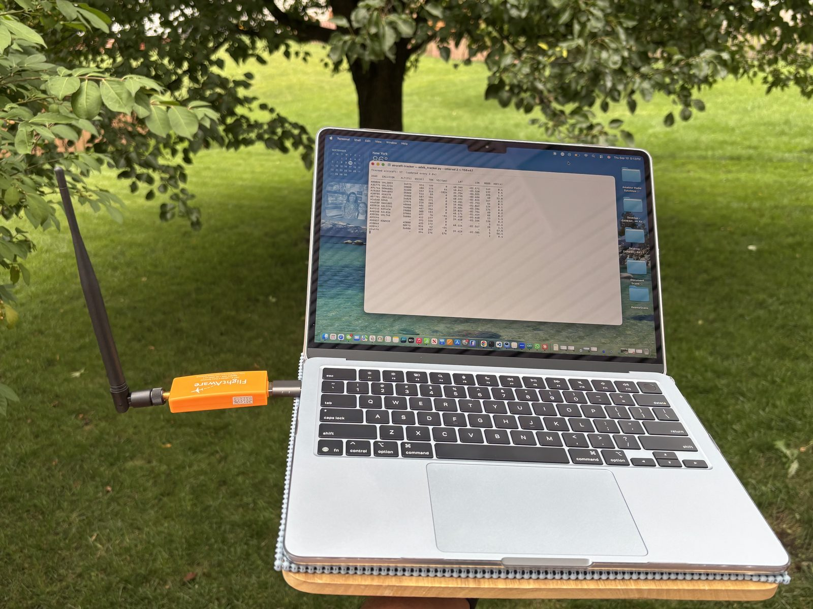
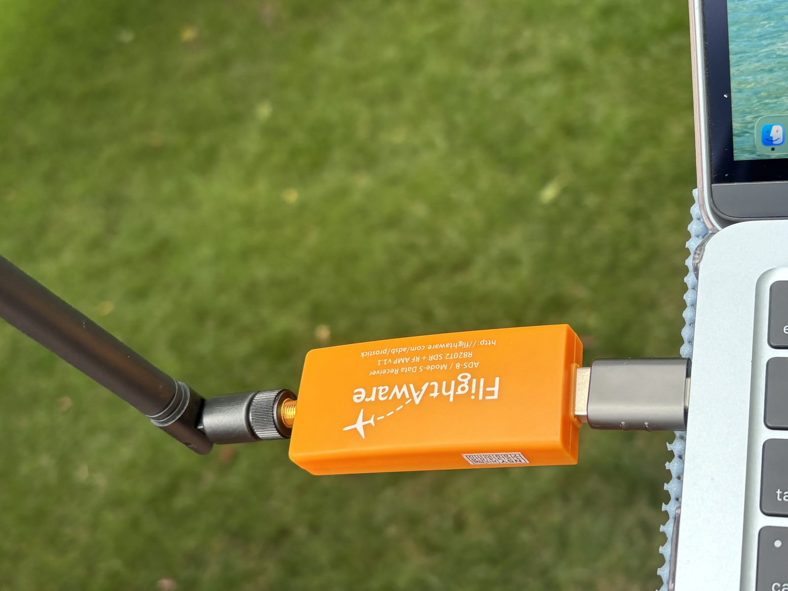
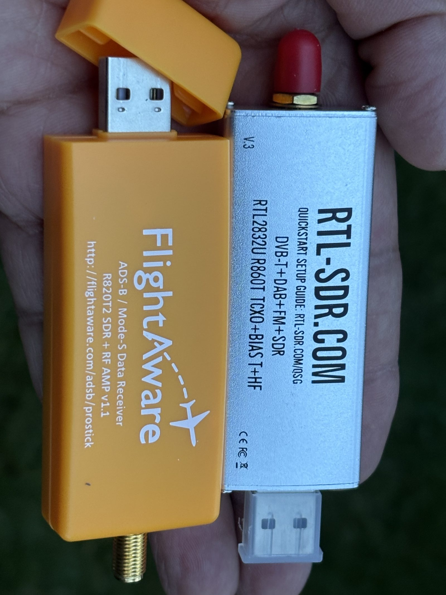
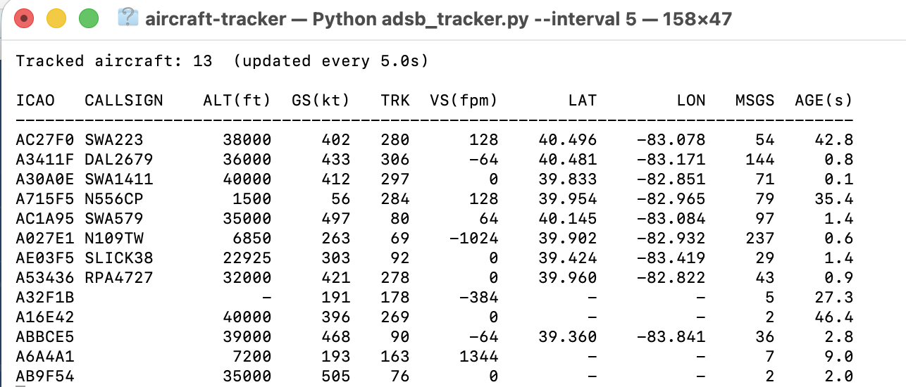
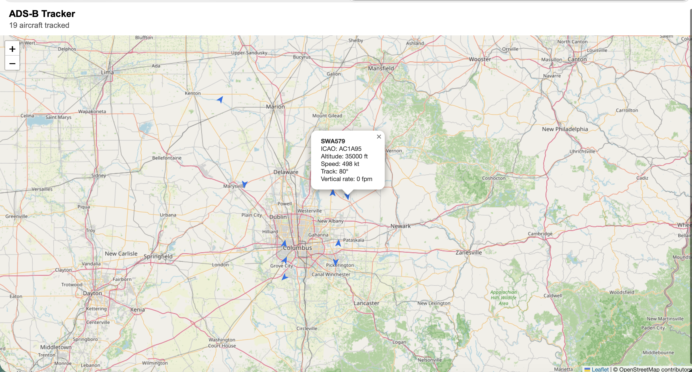

# ADS-B Tracker

A portable, pure-Python ADS-B aircraft tracker for a FlightAware ProStick (or any
RTL2832U/R820T RTL-SDR dongle). It reads raw 1090 MHz IQ samples straight from the
dongle and demodulates ADS-B messages in Python (via [pyModeS](https://github.com/junzis/pyModeS)'s
`RtlReader` + [pyrtlsdr](https://github.com/roger-/pyrtlsdr)) — no dump1090/readsb
binary required.

## What is ADS-B?

Automatic Dependent Surveillance–Broadcast: aircraft determine their own position
via GPS and periodically broadcast it (along with identity, altitude, speed, etc.)
on 1090 MHz, unencrypted, for anyone with an SDR to receive. It's what this project
decodes.

- [Wikipedia: Automatic Dependent Surveillance–Broadcast](https://en.wikipedia.org/wiki/Automatic_Dependent_Surveillance%E2%80%93Broadcast) — overview
- [FAA: ADS-B FAQ](https://www.faa.gov/air_traffic/technology/adsb/faq) — the regulatory/aviation side (why it's mandated, ADS-B In vs Out)
- [The 1090MHz Riddle](https://mode-s.org/1090mhz/) — a free, detailed technical book on decoding Mode S and ADS-B signals, by the author of pyModeS (the library this project decodes with)

## Hardware

The whole rig: a MacBook, the FlightAware ProStick, and its antenna — no extra
receiver box or Raspberry Pi needed.



The ProStick is a RTL2832U + R820T2 dongle, the same SDR chipset family as the
generic RTL-SDR.com dongle it's shown next to below — that compatibility is
what lets this project skip dump1090 and talk to the chipset directly.

| Plugged into the MacBook | Same chipset family as RTL-SDR.com |
| --- | --- |
|  |  |

## Screenshots

| Console table | Live map (`--gui`) |
| --- | --- |
|  |  |

## Requirements

- Python 3.9+
- A FlightAware ProStick (or other RTL2832U-based RTL-SDR dongle) plugged into a USB port
- `librtlsdr` native driver: `brew install librtlsdr`

## Usage

`./run.sh` wraps venv creation, dependency install, and the pyrtlsdr patch (see
below) — first run sets everything up, every run after that just launches the
tracker. No manual venv activation needed.

Console table, using your receiver's coordinates for position decoding and distance:

```
./run.sh --lat 39.9612 --lon -82.9988
```

Without `--lat`/`--lon`, positions still decode, but only once both an even and odd
CPR frame have arrived for an aircraft (slower to populate, no distance column).

Live map in your browser:

```
./run.sh --lat 39.9612 --lon -82.9988 --gui
```

Log snapshots to CSV every 5 seconds:

```
./run.sh --lat 39.9612 --lon -82.9988 --interval 5 --output flights.csv
```

### Manual setup

If you'd rather manage the venv yourself instead of using `run.sh`:

```
python3 -m venv .venv
source .venv/bin/activate
pip install -r requirements.txt
python scripts/patch_pyrtlsdr.py
python adsb_tracker.py --lat 39.9612 --lon -82.9988
```

The patch step is required: `pyrtlsdr` is unmaintained and unconditionally binds a
few GPIO/dithering functions that Homebrew's mainline `librtlsdr` build doesn't
export, which makes `import rtlsdr` (and opening the device) fail. The script
patches the installed package in your venv to skip those bindings when unavailable.
It's idempotent — safe to run again after reinstalling dependencies. `run.sh` runs
it automatically, so you only need this if you're managing the venv by hand.

### Options

- `--lat`, `--lon` — receiver location (decimal degrees). Enables accurate single-message
  position decoding and distance-to-aircraft.
- `--interval SECONDS` — how often the console table/CSV log refreshes (default: 2.0).
- `--count N` — number of refresh cycles before exiting; 0 (default) runs forever.
- `--output FILE` — CSV file to log aircraft snapshots to.
- `--gui` — open a live Leaflet map in your browser instead of the console table.
- `--gain VALUE` — tuner gain in dB, or `auto` (default) for AGC.

Aircraft are dropped from the table/map after 60 seconds without a new message.

## How it works

`pyModeS.extra.rtlreader.RtlReader` streams raw samples from the dongle at 2 Msps,
detects Mode S preambles, and demodulates 112-bit ADS-B frames in Python. Each
decoded message is fed into an in-memory aircraft table keyed by ICAO24 address,
which extracts callsign, altitude, ground speed/track/vertical rate, and position
(via `pyModeS`'s local-reference CPR decode when a receiver location is given, or
even/odd frame pairing otherwise).

## Limitations

- Surface position messages (ground traffic at airports) aren't decoded — only
  airborne position, identification, and velocity.
- Range and message rate depend heavily on antenna placement; a stock ProStick
  antenna indoors will see far fewer aircraft than one with clear sky view.

## Troubleshooting

- **"Could not open the RTL-SDR device"**: check the dongle is plugged in, and
  confirm `librtlsdr` is installed (`brew list librtlsdr`). If you're managing
  the venv by hand instead of using `run.sh`, also run `python scripts/patch_pyrtlsdr.py`.
- **No aircraft appear**: ADS-B needs line-of-sight-ish reception at 1090 MHz;
  try moving the antenna near a window or outdoors, and give it a minute — the
  first identification/position messages can take a few broadcast cycles to arrive.
